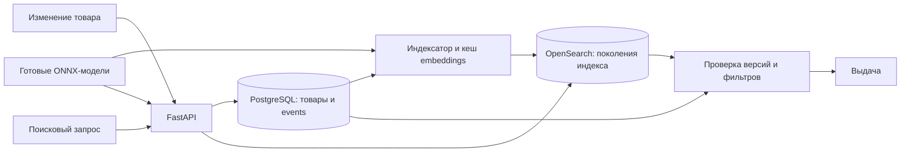

# Как устроен SearchHarbor

PostgreSQL — источник истины о товарах. OpenSearch хранит восстанавливаемое представление для поиска. API не делает двойную запись сразу в обе системы: изменение каталога и событие коммитятся вместе в PostgreSQL, затем worker доставляет событие в индекс.

## Изменение товара и порядок событий

`catalog.mutate()` блокирует единственную строку `catalog_state`. Под этой блокировкой проверяются ключ идемпотентности и ожидаемая версия, увеличивается `sequence`, сохраняются товар, событие и результат запроса.

Номер выдаётся обычным UPDATE в той же транзакции, а не независимой последовательностью PostgreSQL. Следующий запрос на изменение ждёт фиксации предыдущей транзакции: worker не перескочит через более ранний, ещё не зафиксированный номер. Цена этого решения — последовательная обработка всех изменений каталога. Это сознательный предел текущей реализации.

`version` товара равна глобальному номеру изменения. `If-Match` защищает от перезаписи чужого изменения, а `Idempotency-Key` — от повторного выполнения своего запроса после потерянного ответа. Повтор возвращает исторический ответ исходного запроса; текущую версию нужно получать отдельным GET.

Удаление сохраняет тело товара с `deleted=true` и новой версией. Этот tombstone остаётся и в истории, и в индексе. Старое событие с меньшей версией не сможет воскресить товар. Таблица `events` защищена триггером от UPDATE и DELETE. Это защита от обычного изменения строк, не отдельное хранилище, защищённое от администратора БД.

## Журнал вместо брокера

В этой задаче каждое поколение индекса должно прочитать события в одном и том же порядке. Поэтому worker опрашивает `events` по `sequence > cursor`, а не получает сообщение из RabbitMQ. Поколение хранит собственный курсор, и любое из них можно собрать заново с начала истории.

`pg_try_advisory_xact_lock` позволяет выполнять шаг только одному процессу worker. Второй процесс не обрабатывает параллельную пачку. Размер пачки по умолчанию — 100, диапазон `BATCH_SIZE` — 1–500. Блокировка держится во время вычисления embeddings и обращения к OpenSearch; это упрощает порядок выполнения, но добавление процессов worker не ускоряет индексацию.

Для одинаковых текстов worker переиспользует embeddings из PostgreSQL. Ключ кеша — SHA-256 от fingerprint модели и текста `title + description + category`. Варианты, у которых меняется только цена или наличие, не требуют нового вычисления вектора. Фильтры по бренду и цене работают отдельно от этого текста.

## Bulk и повторное выполнение

Пачка отправляется в OpenSearch до commit нового курсора. Каждая операция содержит SKU как `_id`, версию события и `version_type=external_gte`. Та же версия может быть записана снова; меньшая не затрёт большую.

Worker проверяет число элементов bulk-ответа и статус каждого элемента. Успешные записи и явный конфликт более старой версии допустимы. Другая ошибка отменяет транзакцию PostgreSQL, поэтому курсор не проходит неполную пачку. Уже записанные документы OpenSearch при этом не откатываются: следующий шаг повторит пачку с теми же версиями.

Это также закрывает падение после успешного bulk, но до commit курсора. Нет распределённой транзакции между двумя хранилищами и гарантии единственной физической записи. Есть повторяемое применение событий с защитой от устаревших версий.

## Поколения и переключение

Таблица `generations` допускает не больше одного `active` и одного `building`. POST `/admin/rebuilds` создаёт новое уникальное имя и курсор 0. Worker обновляет действующий индекс и читает историю для строящегося.

Когда building догоняет каталог, worker блокирует `catalog_state` и ещё раз сравнивает номера. Пока блокировка держится, новое изменение товара не проскочит между проверкой и переключением. Worker выполняет refresh нового индекса, проверяет ответ и одной транзакцией делает прежний active поколением `retired`, а building — новым active.

Указатель хранится в PostgreSQL, а не в OpenSearch alias. Поисковый запрос один раз выбирает активное имя и использует его для обоих видов поиска. Старые индексы сохраняются, чтобы запрос, начавшийся до переключения, мог завершиться. Retired-индексы больше не получают изменения. Возврат к прежнему поколению и очистка через API не реализованы.

Ограничение в десять поколений учитывает active, building и retired вместе. Это предохранитель от бесконечного роста локального стенда, а не политика автоматического хранения.

Если исчез активный индекс с ненулевым курсором, worker пишет ошибку и не создаёт пустую замену. Оператор запускает новую сборку; пока она не готова, поиск возвращает ошибку доступности. Если потерян индекс building, worker сначала коммитит сброс его курсора в 0 и только на следующем шаге создаёт индекс и повторяет историю. Такой порядок не оставляет после падения пустой индекс со старым курсором.

## Поиск и свежесть данных

Lexical-поиск использует английский анализатор и BM25 по `title^3` и `description` с `fuzziness=AUTO`. Semantic-поиск получает 384-мерный вектор запроса и обращается к HNSW с cosine similarity. Оба применяют фильтры по удалению, цене, категории, бренду и наличию внутри OpenSearch.

Каждый путь возвращает до 100 кандидатов. При `distinct_families=true` OpenSearch сворачивает результаты по семейству, а векторный `k` увеличивается со 100 до 1000. Это ограниченный приближённый отбор, не полный просмотр каталога. Выдачи объединяются по SKU через RRF. После сверки с БД дополнительно убираются повторы семейств.

API читает из PostgreSQL текущие версии найденных SKU. Несовпавшая версия, удаление или несоответствие актуальному фильтру исключают попадание. Товар не подменяется новым телом поверх старого ранга: изменившееся описание могло уже перестать соответствовать запросу.

Из-за такой проверки во время индексации может пропасть часть результатов. Повторного добора до `limit` нет. `lag_events` отражает разницу снимков последовательностей, полученных в начале запроса; это не атомарный снимок всего ответа. Refresh OpenSearch и параллельные изменения могут дать дополнительную задержку, даже если курсор уже догнал журнал.

В `rerank` до 60 оставшихся кандидатов оцениваются моделью cross-encoder. Оценка для одинаковых текстов вычисляется один раз. Итоговый score модели заменяет RRF score, прежний остаётся в `rrf_score`. Этот этап может изменить порядок, но не найти товар, который не попал в кандидаты.

## Модели и их версии

Готовые BGE и MiniLM скачиваются по фиксированным revisions, перечисленным в `models.py`. CPU-провайдер ONNX Runtime задан явно. Fingerprint embedding-модели включает содержимое ONNX-файла, конфигурации и файлов токенизатора. Worker записывает его в `catalog_state.model_hash`; API и worker отказываются смешивать другой fingerprint с этим каталогом.

Обычная пересборка меняет поколение индекса, но сохраняет модель. Протокол миграции на другую модель не реализован. Веса не обучаются и не дообучаются. Реранкер запускается лениво; стоимость первого обращения отличается от прогретого запроса.

## Что показывает наблюдаемость

`/health` проверяет соединение API с БД. `/ready` дополнительно проверяет активное имя, совместимость embedding-модели и запрос к OpenSearch. Готовность не требует нулевого отставания активного индекса.

`/admin/status` показывает состояние каталога, курсоры и ошибки поколений, число живых товаров и heartbeat worker. Heartbeat обновляется отдельной задачей: живой процесс может продолжать отмечаться при ошибке индексации. Поэтому для диагностики нужны и heartbeat, и cursor/error, и логи.

`/metrics` содержит счётчики поисковых запросов по режиму и статусу и гистограмму длительности. Метрики процесса не являются долговременным журналом и сбрасываются после его перезапуска.

В стенде один PostgreSQL и один OpenSearch без реплик. Авторизация администратора — общий демо-токен, внешних сетевых вызовов для inference нет. Изоляция арендаторов, персонализация, модельная миграция и высокая доступность не входят в реализацию.
